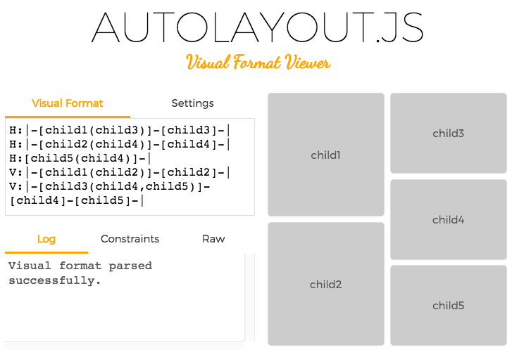

*Click on the image above to start Visual Formatting :D*

The Visual Format Editor allows you to parse and preview Apple's Visual Format Language. It is built using [Cassowary.js](https://github.com/slightlyoff/cassowary.js), [AutoLayout.js](https://github.com/IjzerenHein/autolayout.js), [famo.us](http://famous.org) and [famous-flex](https://github.com/IjzerenHein/famous-flex).

## Query arguments

TODO

## Contribute

If you like this project and want to support it, show some love
and give it a star.

## Contact
-   @IjzerenHein
-   hrutjes@gmail.com (for hire)

© 2015 Hein Rutjes
